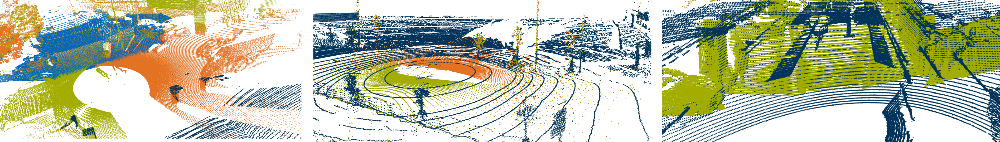
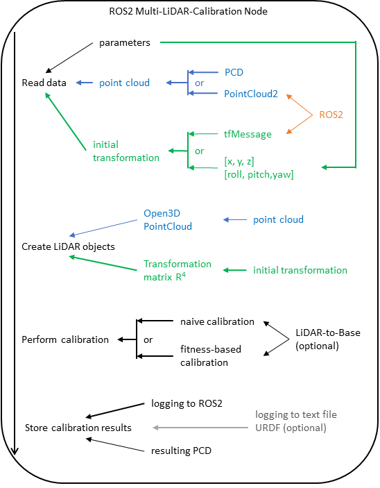

<div align="center">

<h1>Multi - LiCa</h1>

Multi - LiDAR-to-LiDAR calibration framework for ROS 2 and non-ROS applications

[](https://www.linux.org/)
[](https://www.docker.com/)
[](https://docs.ros.org/en/humble/index.html)
[](https://arxiv.org/abs/2501.11088)
[](https://doi.org/10.1109/MFI62651.2024.10705773)



</div>

<h2>Introduction</h2>
This project provides an extrinsic calibration framework for quickly calibrating multiple LiDAR sensors. It employs the Generalized Iterative Closest Point (GICP) algorithm for LiDAR-to-LiDAR extrinsic calibration and uses the RANdom SAmple Consensus (RANSAC) method to calibrate the pitch and z-distance to the ground of a single LiDAR, assuming other coordinates are known.  
  
It has proven to be robust for different sensor setups and environments without the need of an initial guess.  
We use a FPFH-based feature vector creation with an TEASER++ feature matching for the coarse alignment, which is used as initial guess for the GICP algorithm. 

<h2>Overview</h2>
<div align="center">


_Motion- and targetless multi - LiDAR-to-LiDAR Calibration Pipeline,  
 developed at the Institute of Automotive Technology, TUM_

</div>
<h2>Limitations</h2>

- Our tool was specifically developed for motionless calibration.
- We assume that each LiDAR to be calibrated has either a directly overlapping FOV with the target LiDAR FOV or has overlap with other LiDAR(s) with overlap to the target. This can be cascading dependency to the target.
- We assume that the ground is flat and the environment is static.
- Input point clouds for the calibration are in sensor_msgs/PointCloud2 or in .pcd format.

<h2>Prerequisites</h2>
The bare minimum requirement for our tool is a Linux-based OS and Docker, as we provide a Docker image with our framework.  
You do not need to build anything locally, but you are free to do so as described in the following section.  
For the local build, you will need ROS 2 - humble, Python 3.10 with opend3d, scipy, ros2_numpy and pandas (optional).

<h2>Installation and Usage</h2>

<h3>🐋 Docker Environment</h3>

1. Build the Docker image:

   ```
   ./docker/build_docker.sh
   ```

2. Run the container:

   ```
   ./docker/run_docker.sh
   ```

<h3>🖥 Local Build</h3>

1. Install ROS2 humble (might work with other ROS2 distributions but wasn't tested):
   <https://docs.ros.org/en/humble/Installation.html>

2. Create a ROS 2 workspace:

   ```
   mkdir -p ~/ros2_ws
   cd ~/ros2_ws
   ```

3. Clone the repository:

   ```
   git clone git@github.com:TUMFTM/Multi_LiCa.git
   ```

4. Install dependencies:

   ```
   cd Multi_LiCa
   pip install --no-cache-dir --upgrade pip
   pip install --no-cache-dir -r requirements.txt
   ```

5. Source the ROS 2 environment and build the project using `colcon`:

   ```
   source /opt/ros/$ROS_DISTRO/setup.bash
   colcon build --symlink-install --packages-up-to multi_lidar_calibrator --cmake-args -DCMAKE_BUILD_TYPE=Release
   ```

<h3>⏯️ Usage </h3>

1. Configure the parameters to fit your data:

   ```
   vim config/<params-file>.yaml
   ```

2. Launch the multi_lidar_calibrator node:

   ```
   ros2 launch multi_lidar_calibrator calibration.launch.py parameter_file:=/path/to/parameter/file
   ```

<h3>⚙️ Configuration </h3>

- We provided a detailed parameter file with explanation with `config/params.yaml`

- Configure `config/params.yaml` to fit your data. Depending on the application, you may need to specify the LiDARs, paths to .pcd files, or LiDAR topic names. You may also change GICP and RANSAC parameters.

- In addition to LiDAR-to-LiDAR calibration, you can perform target LiDAR-to-ground/base calibration if your x,y translation and roll, yaw rotation are precisely known.  
  If you are using to-base calibration, you may choose a URDF file to save the calibration so that it can be directly used in your ROS robot-state-publisher.

- When running in a container, ensure that your local and container environments have the same ROS_DOMAIN_ID. If not, set it to be the same with `export ROS_DOMAIN_ID=<ID>`.

- When using ROS 2, verify that the transformation guess is published on the `/tf_static` topic and that the data is published for all specified LiDARs.

<h3>🎞️ Demo </h3>

On default, the tool will launch a demo with data from [OpenCalib](https://github.com/PJLab-ADG/SensorsCalibration/tree/master).  
It will open a window and will display three pointclouds and their initial transforms. You can inspect the files in the interactive window. After closing the window (press Q), the tool will calculate the transformations ans will print the results to the terminal, write them to the output directory and will display a windows with the transformed pointclouds.

<h2> Citation </h2>

```bibtex
@article{kulmermfi2024,
  author    = {Kulmer, Dominik and Tahiraj, Ilir and Chumak, Andrii and Lienkamp, Markus},
  title     = {{Multi-LiCa: A Motion- and Targetless Multi - LiDAR-to-LiDAR Calibration Framework}},
  journal   = {2024 IEEE International Conference on Multisensor Fusion and Integration for Intelligent Systems (MFI)},
  pages     = {1-7},
  doi       = {10.1109/MFI62651.2024.10705773},
  year      = {2024},
  codeurl   = {https://github.com/TUMFTM/Multi_LiCa},
}
```

<h2> Other OSS Calibration Frameworks </h2>

- [GMMCalib](https://github.com/TUMFTM/GMMCalib)
- [OpenCalib](https://github.com/PJLab-ADG/SensorsCalibration/tree/master)
- [LL-Calib](https://github.com/autocore-ai/calibration_tools/tree/main/lidar-lidar-calib) 
- [Multi LiDAR Calibrator ROS 1](https://github.com/Ridecell/Autoware/tree/master/ros/src/sensing/fusion/packages/multi_lidar_calibrator)
- [Multi LiDAR Calibrator ROS 2](https://github.com/pixmoving-moveit/multi_lidar_calibration_ros2)
- [mlcc](https://github.com/hku-mars/mlcc)
- [T-FAC](https://github.com/AlienCat-K/LiDAR-Automatic-Calibration)
- [AutoL2LCalib](https://github.com/JunhaAgu/AutoL2LCalib)
- [Multi LiDAR Calibration](https://github.com/yinwu33/multi_lidar_calibration)
- [Multi LiDARs CALIBRATE](https://github.com/GDUT-Kyle/MULTI_LIDARs_CALIBRATE)
- [multi lidar calibration](https://github.com/liuzm-slam/multi_lidar_calibration)
- [Appearance Calibration](https://github.com/ram-lab/lidar_appearance_calibration)
